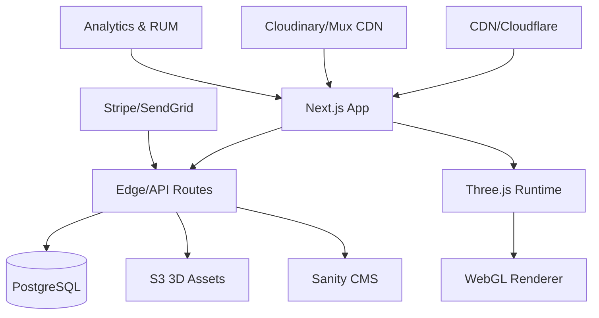

# SOFTWARE SPECIFICATION: PRIMAVERA3D WEBSITE (v1.1)

**Last Updated:** September 2025
**Owner:** Primavera3D Product Team (MADFAM)
**Status:** Ready for Implementation
**Approval:** Pending

---

## Executive Summary

This specification defines the requirements for the standalone **Primavera3D** website—an immersive, portfolio‑driven digital presence that positions Primavera3D as a premier studio for **3D modeling, parametric design, and digital fabrication** within the MADFAM ecosystem.

**Vision**: Deliver a visually stunning, interactive website that demonstrates technical excellence through cutting‑edge 3D experiences, real‑time configurators, and clear, outcomes‑focused case studies.

**Mission**: Convert visitors into qualified clients by showcasing capabilities, precision, and measurable project outcomes in a **visual‑first, fast, and trustworthy** web experience.

---

## Table of Contents

1. [Project Overview](#project-overview)
2. [Brand Identity & Positioning](#brand-identity--positioning)
3. [Target Audiences](#target-audiences)
4. [Technical Architecture](#technical-architecture)
5. [User Experience Design](#user-experience-design)
6. [Content Strategy](#content-strategy)
7. [Portfolio System](#portfolio-system)
8. [3D Showcase Features](#3d-showcase-features)
9. [Service Offerings](#service-offerings)
10. [Interactive Tools](#interactive-tools)
11. [Performance Requirements](#performance-requirements)
12. [Security, Privacy & Compliance](#security-privacy--compliance)
13. [Accessibility](#accessibility)
14. [SEO & Discoverability](#seo--discoverability)
15. [Internationalization & Localization](#internationalization--localization)
16. [Analytics & Optimization](#analytics--optimization)
17. [Integrations & Data Flow](#integrations--data-flow)
18. [Quality Assurance & Testing](#quality-assurance--testing)
19. [Governance & Workflow](#governance--workflow)
20. [Development Roadmap](#development-roadmap)
21. [Success Criteria](#success-criteria)
22. [Risk Mitigation](#risk-mitigation)
23. [Appendices](#appendices)

---

## Project Overview

### Objectives

- Establish Primavera3D as the premium choice for 3D design and digital fabrication in LATAM, U.S., and Europe.
- Showcase portfolio via immersive visual experiences and credible case studies.
- Generate **qualified** leads through interactive demonstrations and streamlined intake.
- Position as the creative + technical arm of MADFAM; reflect solarpunk ethos.
- Build authority in parametric design and digital manufacturing.

### Success Metrics (North‑Star KPIs)

- **+200%** qualified project inquiries (lead quality threshold defined in CRM scoring).
- **≥5:00** average session duration on portfolio/case studies.
- **≥80%** portfolio engagement rate (viewer interactions / views).
- **−50%** sales cycle time (first contact → proposal accepted).
- **100+** technical resource downloads / month.

> **Measurement Notes:** KPIs instrumented via event taxonomy (see _Analytics_), with clear source attribution and MQL definition.

### Key Differentiators

- Interactive 3D model showcases (web, AR/VR) with **real‑time** material/variant switching.
- Parametric design playground + live configurators for selected demos.
- Sustainability impact calculators aligned to MADFAM’s solarpunk positioning.
- Robust case studies with process transparency, specs, and measurable impact.

---

## Brand Identity & Positioning

### Visual Identity

```yaml
Primary Colors:
  Forest Green: "#10B981"
  Deep Green:   "#064E3B"
  Emerald:      "#34D399"

Secondary Colors:
  Natural Brown: "#92400E"
  Sand:          "#FEF3C7"
  Gold Accent:   "#F59E0B"

Neutral Palette:
  Warm Gray: "#6B7280"–"#F9FAFB"
  Charcoal:  "#1F2937"

Typography:
  Display:    "Neue Machina" or "Space Grotesk"
  Body:       "Inter" (fallback: system)
  Technical:  "JetBrains Mono" or "Fira Code"

Design Language:
  - Organic forms with geometric precision
  - Layered depth and subtle parallax
  - Nature‑inspired gradients & premium material textures
  - Technical grid overlays & measurement motifs
```

### Brand Voice

- **Professional yet approachable** — clear, direct, warm.
- **Innovative** — pushing boundaries responsibly.
- **Sustainable** — environmentally conscious by design.
- **Collaborative** — partnership‑first with transparent process.

### Positioning Statement

> **“Primavera3D: Where Ideas Take Shape.”** We transform concepts into reality through cutting‑edge 3D design and digital fabrication.

---

## Target Audiences

### Primary Segments

1. **Architects & Design Firms**
   Roles: Lead Architects, Design Directors, BIM Managers
   Needs: High‑quality, technically accurate visualizations; fast iteration
   Content: Portfolio by building type, technical capabilities, QA process

2. **Manufacturers & Product Companies**
   Roles: Product Managers, R\&D Directors, Industrial Designers
   Needs: Parametric design, prototyping, DFM
   Content: Case studies, material specs, cost calculators

3. **Creative Agencies & Studios**
   Roles: Creative/Art Directors, Producers
   Needs: 3D assets, animation, campaign visuals
   Content: Style showcases, turnaround SLAs, collaboration tools

4. **Startups & Entrepreneurs**
   Roles: Founders, Product Dev, CTOs
   Needs: Rapid prototyping, MVPs, cost‑effective packages
   Content: Service tiers, timeline estimates, startup program

### Secondary Segments

- Educational institutions, government contractors, entertainment, medical/healthcare devices.

---

## Technical Architecture

### Technology Stack

```typescript
// Core Framework
- Next.js 14+ (App Router, Server Components)
- TypeScript 5.x
- React 18

// 3D & Visualization
- Three.js / React Three Fiber
- @google/model-viewer (GLB/USDZ handling)
- Spline Runtime (select experiences)
- A‑Frame (WebXR/AR)
- Babylon.js (alt engine)

// Animation & Interaction
- Framer Motion (UI)
- GSAP + ScrollTrigger (scroll scenes)
- Lottie
- Theatre.js (sequencing)

// UI Components
- Radix UI + shadcn/ui
- Tailwind CSS 3+
- Floating UI

// Media Management
- Cloudinary (image/video/CDN)
- Mux (streaming)
- ImageKit (optional transforms)
- GLTF/DRACO/KTX2 pipeline

// State & Data
- Zustand (client state)
- TanStack Query (server state)
- Prisma ORM + PostgreSQL

// CMS & Content
- Sanity.io (portfolio & pages)
- MDX for technical docs

// Backend Services
- Vercel (Edge Functions)
- AWS S3 (3D model storage)
- SendGrid (email)
- Stripe (payments)

// Analytics & Monitoring
- Vercel Analytics (RUM)
- Sentry (errors)
- Mixpanel (events)
- Hotjar (heatmaps, privacy mode)

// Dev Tooling
- Turborepo (monorepo)
- Storybook (components)
- Playwright (E2E)
- Vitest (unit)
```

### Architecture Pattern



### 3D Asset Pipeline

```yaml
Workflow:
  1. Upload
     - Accepted: GLB/GLTF, FBX, OBJ, STEP/IGES (convert to GLB)
     - Virus scan; size limits & validation
     - Compression & optimization
  2. Processing
     - LOD generation (x3)
     - KTX2 texture compression
     - Thumbnail & turntable video
     - Metadata extraction (poly/tex/size)
     - Optional watermarking
  3. Storage
     - Originals: S3 private
     - Optimized: CDN cacheable
     - Thumbs: Cloudinary
  4. Delivery
     - Progressive loading (skeleton → low → high)
     - Adaptive quality by device/network
     - Smart caching & revalidation
```

### Browser Support Baseline

- Evergreen Chrome, Edge, Firefox; Safari 16+.
- WebGL 2 preferred; graceful fallback to static media if unavailable.

---

## User Experience Design

### Information Architecture

```
Home
├─ Portfolio
│  ├─ All Projects
│  ├─ By Industry (Architecture, Manufacturing, Consumer, Medical, Entertainment)
│  ├─ By Service (3D Modeling, Parametric, Visualization, Fabrication)
│  └─ Featured Case Studies
├─ Services
│  ├─ 3D Modeling & Design
│  ├─ Parametric & Generative Design
│  ├─ Visualization & Rendering
│  ├─ Digital Fabrication
│  ├─ AR/VR Experiences
│  └─ Consulting & Training
├─ Process (Methodology, Tech Stack, QA, Timeline)
├─ Resources (Guides, Materials, Downloads, Tutorials, Standards)
├─ Tools (Cost Calculator, Timeline Estimator, Material Selector, Configurator, AR Viewer)
├─ About (Studio, Team, Facilities, Certifications, Sustainability, Partners)
└─ Contact (Start Project, Quick Quote, Schedule, Partnerships, Careers)
```

### Key User Flows

- **Portfolio Discovery:** Landing → Portfolio Grid → Filter/Search → Project Details → 3D Viewer → Related → Contact
- **Service Evaluation:** Services → Specific Service → Process → Portfolio Examples → Cost Calculator → Quote Request
- **Project Initiation:** Project Configurator → Requirements → Timeline Estimate → Budget Range → Upload Files → Submit Inquiry

### Responsive & 3D Interaction

```scss
// Breakpoints
$mobile: 320px; $tablet: 768px; $desktop: 1024px; $wide: 1440px; $ultra: 1920px;

// Behavior
Mobile: touch gestures, simplified controls
Tablet: enhanced touch, tilt optional
Desktop: mouse + keyboard shortcuts
Wide: multi‑panel layouts
Ultra: immersive, full‑bleed scenes
```

---

## Content Strategy

### Content Types

1. **Portfolio Projects**

```yaml
Hero: cover image/video (16:9), 3D preview, title/category
Overview: client, industry, duration, team, tech used
Challenge: problem, constraints, goals
Solution: approach, process, innovations
Process: timeline viz, stage breakdowns, progress media
Results: deliverables, testimonial, impact metrics, awards
Technical: specs, materials, software stack, gated downloads
Gallery: carousel, 360°, before/after, process videos
SEO: meta, keywords, OG image, schema.org Project
```

2. **Service Pages**

```yaml
Hero: title, subcopy, video, key benefits
Capabilities: features, tech stack, deliverables
Process: workflow, timelines, collaboration model
Portfolio: relevant projects, results, client logos
Pricing: tiers, custom quote, terms
FAQ: common questions, file formats, requirements
CTA: start project, schedule call
```

3. **Technical Resources**: prep guides, materials DB, standards, tutorials, best practices, templates.

4. **Blog & Insights**: spotlights, trends, tutorials, sustainability, team, partnerships.

---

## Portfolio System

### Data Model (TypeScript)

```typescript
interface PortfolioProject {
  metadata: {
    id: string;
    title: string;
    client?: string;
    industry: string;
    services: string[];
    duration?: number; // weeks
    date: Date;
    featured?: boolean;
    confidential?: boolean;
  };
  media: {
    hero: Image | Video;
    gallery: MediaItem[];
    models3D: Model3D[];
    documents?: Document[];
  };
  content: {
    challenge: MDXContent;
    solution: MDXContent;
    process: ProcessStage[];
    results: ResultMetrics;
    testimonial?: Testimonial;
  };
  technical: {
    software: string[];
    techniques?: string[];
    materials?: Material[];
    specifications?: Specification[];
  };
  seo: {
    description: string;
    keywords: string[];
    ogImage: string;
  };
}
```

### Features

- **Advanced Filtering** (industry, service, year, budget, duration, technology; sort by recent/popular).
- **Layouts**: Masonry grid, hover cards, detail list, optional map view.
- **Confidentiality Controls**: blur/redact assets, logo‑masking, NDA gates.

---

## 3D Showcase Features

### Interactive 3D Viewer (API)

```typescript
interface ModelViewer3D {
  controls: {
    rotate: boolean;
    zoom: boolean;
    pan: boolean;
    autoRotate: boolean;
    resetView: () => void;
  };
  annotations: { hotspots: Hotspot[]; measurements: boolean; crossSection: boolean };
  rendering: {
    quality: 'low' | 'medium' | 'high' | 'ultra';
    environment: EnvironmentMap;
    shadows: boolean;
    antialiasing: boolean;
  };
  materials: { switcher: MaterialOption[]; editor: MaterialProperties; presets: MaterialPreset[] };
  export: {
    screenshot: () => void;
    download: (format: ModelFormat) => void;
    share: () => ShareableLink;
    embed: () => EmbedCode;
  };
  ar: { viewInAR: boolean; placement: 'floor' | 'wall' | 'table'; scale: ScaleControls };
}
```

### Parametric Design Playground

```typescript
interface ParametricEditor {
  parameters: {
    sliders: SliderParam[];
    inputs: NumberInput[];
    toggles: BooleanToggle[];
    selectors: OptionSelect[];
  };
  preview: { realTime: boolean; quality: RenderQuality; wireframe: boolean };
  generation: { variations: number; seed: number; export: () => ParametricDefinition };
  sharing: { saveConfiguration: () => ConfigURL; collaborate: () => CollabSession };
}
```

### AR/VR Capabilities

```yaml
AR: WebXR; surface detection; light estimation; USDZ (iOS) + GLB (Android) deep links; screenshot in AR
VR: immersive mode; hand tracking; teleportation; object manipulation; room‑scale demos
```

---

## Service Offerings

### 1) 3D Modeling & Design

```yaml
Capabilities: product design, architectural, character/assets, tech drawings, reverse engineering
Deliverables: high‑poly, game‑ready, CAD, documentation, material specs
```

### 2) Parametric & Generative Design

```yaml
Capabilities: algorithmic design, mass customization, structural optimization, pattern generation, adaptive systems
Deliverables: parametric models, Grasshopper defs, variation matrices, manufacturing files, docs
```

### 3) Visualization & Rendering

```yaml
Capabilities: photoreal rendering, archviz, product viz, animation, virtual tours
Deliverables: hi‑res images, 360° panoramas, animations, interactive tours, marketing assets
```

### 4) Digital Fabrication

```yaml
Capabilities: print prep, CNC CAM, laser nesting, material optimization, QC
Deliverables: print‑ready files, toolpaths, material specs, assembly instructions, QC reports
```

---

## Interactive Tools

### Cost Calculator (Spec)

```typescript
interface CostCalculator {
  inputs: {
    projectType: string;
    complexity: number;
    timeline: DateRange;
    deliverables: string[];
    revisions: number;
  };
  calc: {
    base: number;
    complexityMult: number;
    rushMult: number;
    revisionCost: number;
    total: number;
  };
  output: {
    estimate: PriceRange;
    breakdown: CostBreakdown;
    savings?: VolumeDiscount;
    payment: PaymentOptions;
  };
  actions: { saveQuote(): Quote; scheduleCall(): CalendarLink; startProject(): ProjectForm };
}
```

### Timeline Estimator

```typescript
interface TimelineEstimator {
  project: {
    scope: ProjectScope;
    phases: Phase[];
    dependencies: Dependency[];
    resources: Resource[];
  };
  visualization: { gantt: GanttComponent; milestones: Milestone[]; criticalPath: Path };
  scenarios: { standard: Timeline; expedited: Timeline; phased: Timeline };
}
```

### Material Selector

```typescript
interface MaterialSelector {
  categories: MaterialCategory[];
  filters: {
    properties: PropertyFilter;
    sustainability: EcoFilter;
    cost: PriceRange;
    availability: Stock;
  };
  comparison: { selected: Material[]; properties: ComparisonTable; recommendations: Material[] };
  calculator: { quantity: number; wastage: number; cost: number };
}
```

---

## Performance Requirements

### Core Web Vitals Targets (2025)

```yaml
LCP: ≤ 2.5s (p75)
INP: ≤ 200ms (p75) # replaces FID
CLS: ≤ 0.10 (p75)
TTI: ≤ 3.5s
FCP: ≤ 1.8s

3D Budgets:
  - Model load: < 3s for 10MB GLB on 4G (p75)
  - FPS: 60 desktop / 30 mobile
  - Interaction latency: < 50ms
  - Texture streaming: progressive, KTX2
```

### Optimization Strategies

**3D**

```yaml
- Draco geometry compression
- KTX2/Basis textures
- LODs, instancing, occlusion culling
- Progressive loading & suspense fallbacks
```

**Media**

```yaml
- AVIF/WebP responsive images
- Lazy loading + blur‑up
- CDN caching & signed URLs
- Adaptive bitrate (Mux/Cloudinary)
```

**Code**

```yaml
- Route‑level code‑splitting; dynamic imports
- Tree shaking; bundle analysis
- Service Worker for caching where safe
- Critical CSS; purge unused styles; variable fonts
```

---

## Security, Privacy & Compliance

### Asset Protection

```yaml
3D Models:
  - Optional watermarking & logo masking
  - View‑only tokens; download restrictions
  - Access control (RBAC)
  - Usage tracking & DMCA process
Client Data:
  - Encrypted transit & at rest
  - Secure file transfer (uploads to S3 presigned)
  - NDA tagging & access logs
  - Data retention policies by region
```

### Technical Security

```yaml
- SSL/TLS; HSTS; security headers
- WAF & DDoS mitigation; rate limiting
- OAuth2/JWT; optional MFA
- Session management; CSRF protection
- Secrets management (Vercel + AWS)
- Dependency scanning & SCA; regular patching
```

### Privacy & Regulatory

- GDPR (EU), CCPA/CPRA (U.S.), LGPD (BR), and Mexico data law alignment.
- Consent Management Platform (CMP) for cookies/trackers; granular toggles.
- DPA & SCCs with vendors; regional data residency options.

---

## Accessibility

- Conform to **WCAG 2.2 AA**.
- Keyboard navigation for all interactive components and **3D viewer controls**; focus states visible.
- Motion‑reduced versions (prefers‑reduced‑motion); configurable auto‑rotate.
- Alt text, transcripts/captions, semantic HTML, ARIA where appropriate.
- High‑contrast mode; color contrast ≥ 4.5:1 for text.
- Form labels, error messaging, and field instructions programmatically associated.

---

## SEO & Discoverability

- Technical SEO: canonical URLs, XML sitemap, robots, clean URLs, hreflang.
- Structured Data: Organization, Service, Project, Article, VideoObject, 3DModel (where applicable).
- Performance budgets met; image alt; lazy but not for LCP element.
- Link architecture: contextual cross‑links from services → case studies → tools.

---

## Internationalization & Localization

- Initial locales: **en‑US**, **es‑MX** (copy parity), scalable to **pt‑BR**.
- Use `next-intl` or equivalent; localized metadata, dates, numbers.
- CMS supports per‑locale content and asset variants.

---

## Analytics & Optimization

### Tracking Framework (Event Taxonomy)

```typescript
interface AnalyticsEvents {
  portfolio: {
    view: string;
    interact3D: string;
    downloadRequest: string;
    timeSpent: number;
    device: string;
  };
  threeD: { orbit: number; zoom: number; matSwap: string; arLaunch: boolean; export: string };
  conversion: {
    startProject: boolean;
    quoteRequest: boolean;
    scheduleCall: boolean;
    source: string;
  };
  content: { searchTerm: string; filterUsed: string; exitPage: string };
}
```

### Experimentation

- Vercel Edge Config / Experiments; Optimizely or VWO.
- Test: portfolio layouts, 3D controls, CTA placement, pricing display, forms.

---

## Integrations & Data Flow

- **CRM:** HubSpot or Pipedrive (lead capture, MQL scoring, sequences).
- **Calendaring:** Cal.com or Calendly; round‑robin scheduling.
- **Email:** SendGrid (transactional) + marketing provider.
- **Payments:** Stripe (deposits, prototypes, training).
- **Auth/SSO:** Optional MADFAM SSO for client portal (post‑launch).

---

## Quality Assurance & Testing

- **Automated:** unit (Vitest), component (Storybook tests), E2E (Playwright).
- **Manual:** cross‑browser/device matrix; 3D performance checks; accessibility audit.
- **Acceptance Criteria:** each feature meets perf, a11y, analytics, and SEO gates.

---

## Governance & Workflow

- **RACI:** Product (R), Design (A), Eng (R), QA (C), Marketing/Sales (C), Leadership (I).
- **Content Ops:** draft → review → legal/brand check → publish; versioned in CMS.
- **Definition of Done:** specs met; tests passing; Lighthouse ≥ 90; a11y AA; events firing; documentation updated.

---

## Development Roadmap

### Phase 1 — Foundation (Weeks 1–4)

- Design system & tokens; base layout & navigation
- Component library (shadcn/radix); basic routes
- Portfolio schema & Sanity CMS integration
- CI/CD, environments, observability

**Gate:** deployable shell; Lighthouse ≥ 90 (no 3D yet)

### Phase 2 — Portfolio System (Weeks 5–8)

- Grid layouts, search & advanced filters
- Project detail pages; confidentiality controls
- Media management & CDN pipelines

**Gate:** 10+ projects live; analytics events wired

### Phase 3 — 3D Integration (Weeks 9–12)

- Model viewer (GLB/GLTF) with controls & annotations
- AR Quick Look/Scene Viewer; performance optimization
- Progressive loading & device adaptivity

**Gate:** 60fps desktop scenes; fallback works

### Phase 4 — Interactive Tools (Weeks 13–16)

- Cost calculator, timeline estimator, material selector
- Project configurator & forms (spam protection)

**Gate:** conversion flow tracked end‑to‑end

### Phase 5 — Content & Polish (Weeks 17–20)

- Portfolio migration, case studies, SEO
- Perf hardening, a11y audit, legal/privacy
- Launch checklist & playbook

**Gate:** Go‑Live

### Phase 6 — Advanced (Post‑Launch)

- Parametric playground, VR scenes, AI design assistant
- Client portal (SSO), advanced analytics & dashboards

---

## Success Criteria

### Launch Requirements

- ≥ 20 portfolio projects; all services documented
- 3D viewer functional across supported devices
- Median page load < 3s; Lighthouse ≥ 90 across pages
- A11y: WCAG 2.2 AA; privacy & cookie consent live

### 6‑Month Business Targets

- +200% qualified leads; +50% conversion
- 500+ resource downloads; NPS ≥ 85
- ≥ 5 enterprise clients initiated

### Technical SLOs

- 60fps 3D interactions (desktop), 30fps (mobile)
- 99.9% uptime (monthly), RTO ≤ 4h, RPO ≤ 1h
- Zero critical security incidents; INP ≤ 200ms (p75)

---

## Risk Mitigation

### Technical

```yaml
3D Performance: low‑end devices
  → Progressive enhancement; quality presets; static fallbacks
Browser Compatibility: WebGL unsupported
  → Feature detection; auto fallback to imagery/video
Asset Size: large GLBs
  → Draco, KTX2, LOD, CDN; authoring guidelines
```

### Business

```yaml
Portfolio Confidentiality
→ NDA gating; anonymized cases; logo masking
Competitive Differentiation
→ Focus on real‑time/parametric demos; measurable outcomes; solarpunk framing
```

---

## Appendices

### A. Competitor Landscape (reference)

- Autodesk Gallery, Behance 3D, ArtStation, Shapeways, Formlabs

### B. Technology Partners

- Three.js, Vercel, Cloudinary/Mux, Sanity, Stripe

### C. Industry Standards

- STEP/IGES, STL (printing), glTF 2.0 (web), USD/USDZ (interchange/AR), WebXR

### D. Recommended Reading

- Three.js docs; MDN WebGL best practices; React Three Fiber docs; web.dev performance; W3C WCAG 2.2

### E. Contacts (TBD)

- Technical Lead, Design Lead, Product Owner, Project Manager

---

> **Notes on Changes vs. v1.0.0**
> • Replaced **FID** with **INP** for Core Web Vitals.
> • Added Accessibility (WCAG 2.2 AA), Privacy/CMP, Internationalization, Governance, QA.
> • Clarified 3D asset pipeline, browser support, and performance budgets.
> • Updated Experimentation tools (post‑Google Optimize).
> • Added SLOs (uptime/RTO/RPO) and acceptance gates per phase.
